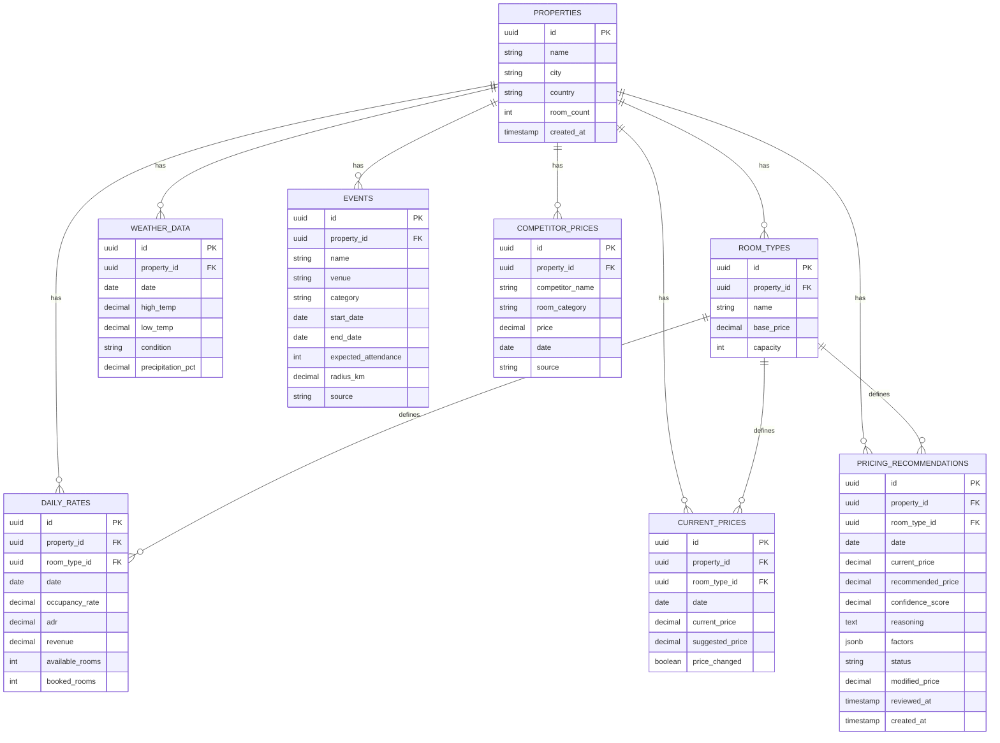
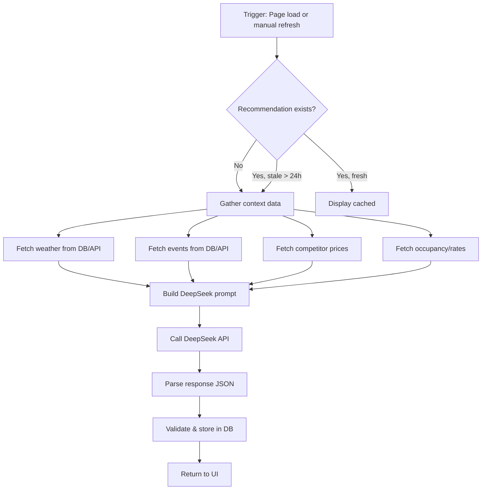

# Hotel Dynamic Pricing Dashboard — MVP Architecture Plan

> **Currency:** All prices in IDR (Indonesian Rupiah) throughout the application.

## Stack Overview

| Layer | Technology |
|-------|-----------|
| Frontend | Next.js 14+ (App Router) + Tailwind CSS |
| Backend | Next.js API Routes |
| AI Engine | DeepSeek API (pricing recommendations + reasoning) |
| Database | Supabase (Postgres) |
| External APIs | OpenWeatherMap, PredictHQ (events) |
| Competitor Data | Mock/synthetic data (MVP), adapter pattern for real API later |
| PMS Data | Mock seed data + CSV upload structure |
| Auth | Single-user MVP (multi-user ready schema) |
| Deployment | Vercel |

---

## Project Structure

```
hotel-dashboard/
├── src/
│   ├── app/
│   │   ├── layout.tsx                    # Root layout with sidebar
│   │   ├── page.tsx                      # Today's Overview (landing page)
│   │   ├── calendar/
│   │   │   └── page.tsx                  # 30-Day Pricing Calendar
│   │   ├── recommendations/
│   │   │   └── page.tsx                  # Recommendation Feed
│   │   ├── settings/
│   │   │   └── page.tsx                  # Settings / CSV upload
│   │   └── api/
│   │       ├── pricing/
│   │       │   ├── recommend/route.ts    # DeepSeek AI recommendation
│   │       │   ├── batch-recommend/route.ts  # Bulk 30-day recs
│   │       │   └── review/route.ts       # Approve/Modify/Reject
│   │       ├── pms/
│   │       │   └── upload/route.ts       # CSV import
│   │       ├── weather/route.ts          # OpenWeatherMap proxy
│   │       └── events/route.ts           # PredictHQ proxy
│   ├── components/
│   │   ├── layout/
│   │   │   ├── Sidebar.tsx
│   │   │   └── Header.tsx
│   │   ├── dashboard/
│   │   │   ├── TodayOverview.tsx          # Main overview widget
│   │   │   ├── KpiCard.tsx               # Reusable KPI card
│   │   │   ├── OccupancyChart.tsx        # Chart component
│   │   │   ├── RevenueChart.tsx
│   │   │   └── ExternalFactors.tsx       # Weather + Events widget
│   │   ├── calendar/
│   │   │   ├── PricingCalendar.tsx        # 30-day grid
│   │   │   └── CalendarDay.tsx           # Single day cell
│   │   └── recommendations/
│   │       ├── RecommendationFeed.tsx     # Feed container
│   │       ├── RecommendationCard.tsx     # Single rec card
│   │       └── ApprovalActions.tsx        # Approve/Modify/Reject
│   ├── lib/
│   │   ├── supabase/
│   │   │   ├── client.ts                 # Supabase browser client
│   │   │   └── server-client.ts          # Supabase server/client (API routes)
│   │   ├── ai/
│   │   │   └── deepseek.ts               # DeepSeek API wrapper + prompt builder
│   │   ├── services/
│   │   │   ├── pricing-service.ts        # Pricing business logic
│   │   │   ├── weather-service.ts        # OpenWeatherMap fetcher
│   │   │   ├── events-service.ts         # PredictHQ fetcher
│   │   │   └── competitor-service.ts     # Mock competitor adapter
│   │   ├── seed/
│   │   │   └── generate-seed.ts          # Seed data generator script
│   │   └── utils/
│   │       ├── format.ts                 # Number/date formatters
│   │       └── constants.ts              # Env vars, config
│   └── types/
│       └── index.ts                      # All TypeScript types
├── supabase/
│   └── migrations/
│       └── 001_initial_schema.sql
├── seed-data/
│   ├── sample-pms.csv                    # Example CSV template
│   └── README.md
├── .env.local.example
├── tailwind.config.ts
├── next.config.ts
└── package.json
```

---

## Database Schema (Supabase/Postgres)



### Key Schema Design Decisions

1. **`properties` table** — Single property now, but structured for multi-property later. MVP inserts one default property.
2. **`daily_rates`** — Historical occupancy & revenue data from PMS/CSV. `UNIQUE(property_id, room_type_id, date)` prevents duplicates.
3. **`current_prices`** — Active/suggested prices separate from historical rates. The `price_changed` flag tracks modifications.
4. **`competitor_prices`** — Mock data now, with `source` column for future API swap.
5. **`pricing_recommendations`** — The core table. `status` enum: `pending` | `approved` | `modified` | `rejected`. `factors` JSONB stores AI reasoning context.

---

## Page Designs & Data Flow

### Page 1: Today's Overview (`/`)

```
┌─────────────────────────────────────────────────────────┐
│ [Logo]  Hotel Dashboard        [Date]  [Weather Icon]   │
├──────────┬──────────────────────────────────────────────┤
│          │ ┌──────┐ ┌──────┐ ┌──────┐ ┌──────┐         │
│ Sidebar  │ │Occup │ │ ADR  │ │RevPAR│ │Events│         │
│          │ └──────┘ └──────┘ └──────┘ └──────┘         │
│ 📊 Today │                                               │
│ 📅 Cal.  │ ┌────────────────────────────────────────┐   │
│ 🔔 Recs  │ │ Occupancy Trend (7-day chart)          │   │
│ ⚙️ Sets  │ │                                        │   │
│          │ └────────────────────────────────────────┘   │
│          │ ┌────────────────────────────────────────┐   │
│          │ │ External Factors:                       │   │
│          │ │ ☀️ Weather: Sunny 28°C                  │   │
│          │ │ 🎪 Events: Marathon nearby (10k people) │   │
│ │ │ 🏨 Competitors: Avg Rp 285K vs your Rp 299K   │   │
│          │ └────────────────────────────────────────┘   │
│          │ ┌────────────────────────────────────────┐   │
│          │ │ 💡 AI Suggestion: Raise Deluxe to Rp 315K  │   │
│          │ │    [View Details →]                     │   │
│          │ └────────────────────────────────────────┘   │
└──────────┴──────────────────────────────────────────────┘
```

**Data Flow:**
1. Page loads → calls `GET /api/pricing/overview` (or uses Supabase directly)
2. Fetches today's `current_prices`, `daily_rates`, `weather_data`, `events`, `competitor_prices`
3. If no recommendation exists for today, triggers DeepSeek AI call
4. Renders KPI cards, charts (Recharts), external factors panel

### Page 2: 30-Day Pricing Calendar (`/calendar`)

```
┌─────────────────────────────────────────────────────────┐
│ [Logo]  Pricing Calendar                    [Month]     │
├──────────┬──────────────────────────────────────────────┤
│          │ ┌───────────────────────────────────────┐    │
│ Sidebar  │ │  Mon   Tue   Wed   Thu   Fri   Sat   Sun │ │
│          │ │ ┌────┐ ┌────┐ ┌────┐ ┌────┐ ┌────┐     │ │
│          │ │ │ 1  │ │ 2  │ │ 3  │ │ 4  │ │ 5  │ ... │ │
│ │ │ │Rp299K│ │Rp299K│ │Rp319K│ │Rp349K│ │Rp399K│  │ │
│          │ │ │ 72% │ │ 75% │ │ 80% │ │ 90% │ │ 95% │  │ │
│          │ │ └────┘ └────┘ └────┘ └────┘ └────┘     │ │
│          │ │  ...                                    │ │
│          │ └───────────────────────────────────────┘    │
│          │ Legend: [Current] [AI Suggested] [Approved]  │
└──────────┴──────────────────────────────────────────────┘
```

**Data Flow:**
1. Page loads → fetches `current_prices` + `pricing_recommendations` for next 30 days
2. Calls `POST /api/pricing/batch-recommend` if some dates lack recommendations
3. Color-coded cells: blue = current, green = AI suggested, purple = approved
4. Click day → modal with full context (weather, events, competitors, AI reasoning)

### Page 3: Recommendation Feed (`/recommendations`)

```
┌─────────────────────────────────────────────────────────┐
│ [Logo]  Recommendations         Filter: [All ▼]         │
├──────────┬──────────────────────────────────────────────┤
│          │ ┌────────────────────────────────────────┐   │
│ Sidebar  │ │ 📅 Tomorrow, May 27 — Deluxe Room       │   │
│          │ │ Current: Rp 299K  →  Suggested: Rp 329K       │   │
│          │ │ Confidence: 85%                         │   │
│          │ │ Reasoning: High occupancy 90% + concert │   │
│          │ │ nearby driving demand. Weather is       │   │
│          │ │ favorable (sunny, 28°C).                │   │
│          │ │                                         │   │
│          │ │ [✏️ Modify]  [✅ Approve]  [❌ Reject]   │   │
│          │ └────────────────────────────────────────┘   │
│          │ ┌────────────────────────────────────────┐   │
│          │ │ 📅 May 28 — Standard Room               │   │
│          │ │ ...                                    │   │
│          │ └────────────────────────────────────────┘   │
│          │ ┌────────────────────────────────────────┐   │
│          │ │ 📅 May 29 — Suite Room                  │   │
│          │ │ ...                                    │   │
│          │ └────────────────────────────────────────┘   │
└──────────┴──────────────────────────────────────────────┘
```

**Data Flow:**
1. Page loads → fetches `pricing_recommendations` where `status = 'pending'`
2. Each card shows full AI reasoning + factors
3. **Approve**: `PATCH /api/pricing/review` → sets `status='approved'`, updates `current_prices.suggested_price`
4. **Modify**: Opens inline editor → user enters custom price → sets `status='modified'`, `modified_price`
5. **Reject**: `PATCH /api/pricing/review` → sets `status='rejected'`

---

## DeepSeek AI Integration

### Prompt Architecture

```
System Prompt:
"You are an expert hotel revenue manager AI. Analyze the provided data and 
recommend optimal room pricing. Consider occupancy rates, competitor pricing, 
weather forecasts, local events, and historical patterns. Return structured JSON."

User Prompt (per date + room type):
Context for {date} - {room_type}:
  Current Price: Rp {current_price}
  Occupancy: {occupancy}%
  ADR: Rp {adr}
  Available Rooms: {available}
  Booked Rooms: {booked}

External Factors:
  Weather: {condition}, {high_temp}°C / {low_temp}°C
  Events: {event_names} (attendance: {attendance})
  Competitor Avg: Rp {competitor_avg}

Return JSON:
{
  "recommendedPrice": number,
  "confidenceScore": number (0-100),
  "reasoning": string (max 3 sentences),
  "keyFactors": string[] (max 3 factors)
}
```

### Recommendation Logic Flow



---

## API Route Design

| Method | Route | Purpose |
|--------|-------|---------|
| GET | `/api/pricing/overview` | Today's aggregated data |
| POST | `/api/pricing/recommend` | Single date recommendation |
| POST | `/api/pricing/batch-recommend` | 30-day bulk recommendations |
| PATCH | `/api/pricing/review` | Approve/Modify/Reject |
| POST | `/api/pms/upload` | CSV file upload + parse |
| GET | `/api/weather?lat=&lon=` | OpenWeatherMap proxy |
| GET | `/api/events?lat=&lon=&radius=` | PredictHQ proxy |

---

## Component Tree

```
RootLayout
├── Sidebar (client component)
│   ├── Logo
│   ├── NavLink: Today's Overview (/)
│   ├── NavLink: Pricing Calendar (/calendar)
│   ├── NavLink: Recommendations (/recommendations)
│   └── NavLink: Settings (/settings)
├── Header (client component)
│   ├── Current Date
│   ├── Weather Widget (minimal)
│   └── Pending Recs Badge
└── Page Content (via App Router)
    ├── TodayOverview
    │   ├── KpiCard (Occupancy)
    │   ├── KpiCard (ADR)
    │   ├── KpiCard (RevPAR)
    │   ├── OccupancyChart (Recharts)
    │   ├── RevenueChart (Recharts)
    │   ├── ExternalFactors
    │   │   ├── WeatherBlock
    │   │   ├── EventsBlock
    │   │   └── CompetitorBlock
    │   └── AISuggestionBanner
    ├── PricingCalendar
    │   ├── MonthNavigation
    │   └── CalendarDay[] (30 cells)
    │       └── DayModal (on click)
    │           ├── PriceComparison
    │           ├── FactorsBreakdown
    │           └── ApproveButton
    └── RecommendationFeed
        ├── FilterBar (All/Pending/Approved/Rejected)
        └── RecommendationCard[]
            ├── DateBadge
            ├── PriceComparison
            ├── ReasoningBlock
            ├── FactorTags
            ├── ModifyInput (inline edit)
            ├── ApproveButton
            ├── ModifyButton
            └── RejectButton
```

---

## Mock Data Generation

For the MVP, all data will be synthetic. The seed script (`src/lib/seed/generate-seed.ts`) will:

1. **Create 1 property** with 3 room types (Standard, Deluxe, Suite)
2. **Generate 90 days** of historical daily_rates with realistic patterns:
   - Weekday occupancy: 60-75%, Weekend: 80-95%
   - ADR correlated with occupancy
3. **Generate 30 days** of forward-looking data (current_prices)
4. **Generate competitor prices** — 3 nearby hotels with ±15% variance
5. **Inject seasonal events** — 2-3 events per 30-day window (concerts, conferences, holidays)
6. **Generate weather** — Realistic seasonal patterns by month

---

## Environment Variables

```bash
# .env.local
NEXT_PUBLIC_SUPABASE_URL=
NEXT_PUBLIC_SUPABASE_ANON_KEY=
SUPABASE_SERVICE_ROLE_KEY=

DEEPSEEK_API_KEY=
DEEPSEEK_MODEL=deepseek-chat  # or deepseek-reasoner

OPENWEATHERMAP_API_KEY=

PREDICTHQ_API_KEY=

# Property config
DEFAULT_PROPERTY_NAME="My Hotel"
DEFAULT_PROPERTY_CITY="Jakarta"
DEFAULT_PROPERTY_LAT=-6.2088
DEFAULT_PROPERTY_LNG=106.8456
```

---

## Execution Plan (15 Tasks)

### Phase 1: Foundation
1. **Task 1** — Initialize Next.js project with Tailwind, install deps (supabase-js, recharts, papaparse, lucide-react), create folder structure
2. **Task 2** — Set up Supabase project, run migration SQL, verify tables
3. **Task 3** — Build seed data generator script, run it to populate DB
4. **Task 4** — Implement Supabase client lib + TypeScript type definitions

### Phase 2: Core UI
5. **Task 5** — Build shared layout (Sidebar + Header) with navigation
6. **Task 6** — Build Today's Overview page with KPI cards + charts + external factors
7. **Task 7** — Build 30-Day Pricing Calendar with colored day cells + click modal
8. **Task 8** — Build Recommendation Feed with Approve/Modify/Reject cards

### Phase 3: AI & API Integration
9. **Task 9** — Implement DeepSeek AI wrapper + prompt builder + recommendation API route
10. **Task 10** — Implement OpenWeatherMap API integration + proxy route
11. **Task 11** — Implement PredictHQ events API integration + proxy route
12. **Task 12** — Build PMS CSV upload route + UI (drag-and-drop + parse)

### Phase 4: Polish
13. **Task 13** — Wire weather + events data into dashboard components
14. **Task 14** — Wire recommendation approval/modification API routes into UI
15. **Task 15** — Final integration testing, error handling, Vercel deployment prep

---

## Key Libraries

| Library | Purpose |
|---------|---------|
| `@supabase/supabase-js` | Database client |
| `recharts` | Charts (occupancy, revenue) |
| `lucide-react` | Icons |
| `papaparse` | CSV parsing |
| `date-fns` | Date formatting |
| `@radix-ui/react-dialog` | Modal for calendar day |
| `@radix-ui/react-select` | Dropdowns/filters |
| `tailwind-merge` | Utility class merging |
| `clsx` | Conditional classes |
